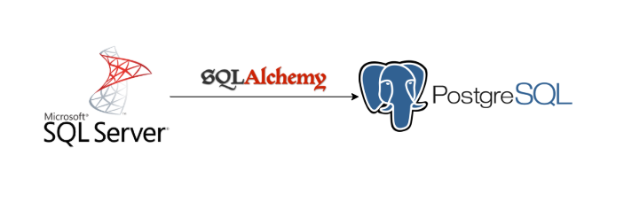

# Data Pipeline: PostgreSQL, Python, dbt e Airflow

Este projeto implementa um pipeline de dados completo para ingestão, tratamento e orquestração de dados. Utilizando as melhores práticas de engenharia de dados, como containerização, ingestão programática com Python, modelagem em camadas com o **esquema Medallion (bronze → silver → gold)** via `dbt`, e automação com **Apache Airflow**.

## Estrutura do Projeto
O projeto foi estruturado em três etapas:

1. **Banco de Dados PostgreSQL** com Docker Compose  e **Ingestão de dados via SQLAlchemy** com Python. [Repositório Etapa 1](https://github.com/diogo-minoru/projeto_airflow_dbt_local_setup)
2. **Modelagem dos dados com dbt** e o esquema Medallion. [Repositório Etapa 2](https://github.com/diogo-minoru/projeto_airflow_dbt_data_warehouse)
3. **Orquestração completa com Apache Airflow.** [Repositório Etapa 3](https://github.com/diogo-minoru/projeto_airflow_dbt_airflow)
4. Análise dos dados com Power BI. [Dashboard](https://app.powerbi.com/view?r=eyJrIjoiNmVmYzNlYTEtZDRjNi00YThhLWIwMGMtMzFmYTE4NDNmNzU1IiwidCI6Ijg4NTA2YTc5LWZlYTctNDAwYS1hOTc4LTc1ZjAxMGYzMDcxZiJ9)

## Etapa 1 - Banco de Dados com Docker Compose + Ingestão dos dados

Primeira Etapa – Migração de Dados
Esta etapa simula um cenário real de migração de dados, onde as informações de um banco de dados de produção são transferidas para outro banco de dados destinado a atuar como Data Warehouse.

Para esta simulação, considerou-se um ambiente onde o banco de dados de produção é um SQL Server, e os dados são migrados para um banco de dados PostgreSQL, utilizando a biblioteca SQLAlchemy do Python para estabelecer a conexão e realizar a transferência.



Para realizar a migração, foi criada a classe `SqlServerToPostgresMigrator`, localizada no arquivo `migrate_sqlserver.py`. Essa classe é responsável pela lógica de transferência dos dados e é utilizada por outros módulos presentes na pasta `consultas`.

**Estrutura das pastas:**
```bash
1_local_setup/
├── src/
│   └── migrate_sqlserver.py
│   └── test_connection.py
├── consultas/
│   └── currencyexchange.py
│   └── customers.py
│   └── orderrows.py
│   └── orders.py
│   └── store.py
└── docker-compose.yml
```

O banco de dados PostgreSQL é definido no `docker-compose.yml`, criando um novo banco com nome **dbt_db**

```yml
services:
  postgres:
    image: postgres:latest
    container_name: dbt_postgres
    environment:
      POSTGRES_USER: ${DBT_USER}
      POSTGRES_PASSWORD: ${DBT_PASSWORD}
      POSTGRES_DB: dbt_db
    ports:
      - "5433:5432"
    volumes:
      - postgres_data:/var/lib/postgresql/data
    healthcheck:
      test: ["CMD-SHELL", "pg_isready -U ${DBT_USER} - dbt_db"]
      interval: 5s
      timeout: 5s
      retries: 5
  
volumes:
  postgres_data:
```

Para subir o ambiente:

```bash
docker-compose up -d
```
Com o docker em execução, é possível executar os códigos para copiar as tabelas que estão no SQL Server para o Postgre SQL.

[Repositório Etapa 2](https://github.com/diogo-minoru/projeto_airflow_dbt_data_warehouse)